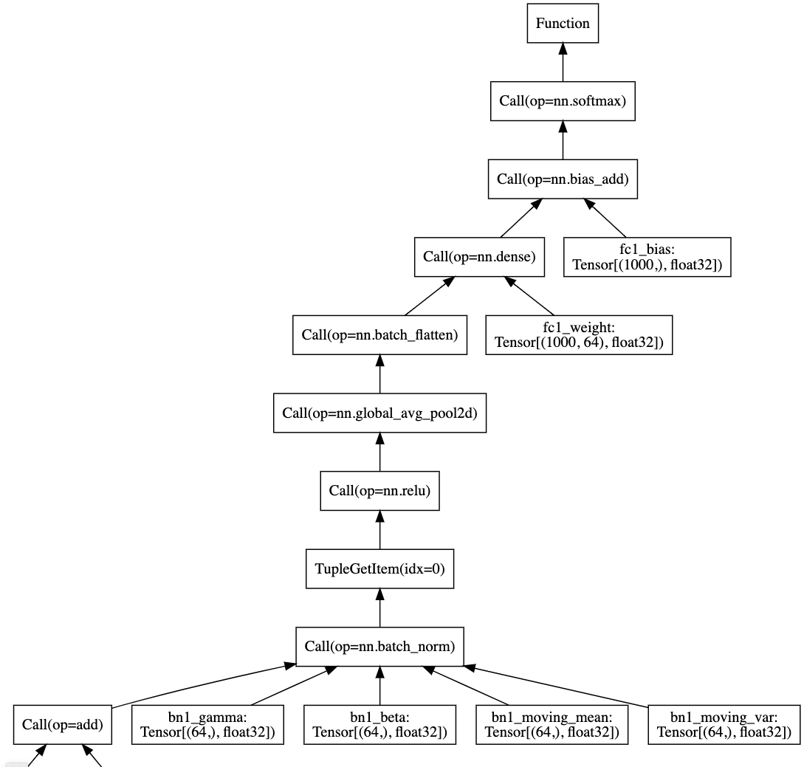

# RelayViz: Visualize TVM Relay program graph

I wrote this script to address my pain point: I found it difficult to make sense of what's going on
in a [Relay](https://docs.tvm.ai/dev/relay_intro.html) program.

